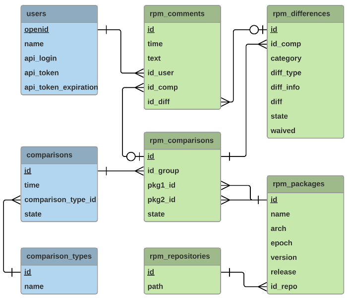

# Archdiffer

Archdiffer is a web service for generic archive comparison. The main purpose is to compare different versions of software packages in order to simplify version verification.

The web is written in Flask, the comparison tasks are managed using Celery. Archdiffer is extensible by plugins. So far, only plugin rpmdiff for comparing RPM packages is implemented.

## Getting Started

Archdiffer consists of two parts, flask-frontend and backend, and can be therefore installed on two separate systems.

### Prerequisites

To run archdiffer, you need to set up:

* database that is [supported by SQLAlchemy](http://docs.sqlalchemy.org/en/latest/core/engines.html#supported-databases) (in some cases you will also need to install some additional dependencies, for example python3-psycopg2 for postgresql)

* message broker that is [supported by Celery](docs.celeryproject.org/en/latest/getting-started/brokers/index.html) (for example RabbitMQ)

* HTTP server - for example Apache (requires httpd and python3-mod_wsgi), archdiffer provides .wsgi file and .conf file for Apache

### Installing

Either install separately frontend and backend:

```
$ sudo dnf install archdiffer-flask-frontend
$ sudo dnf install archdiffer-backend
```

Or install both at once:

```
$ sudo dnf install archdiffer
```

Then install all desired plugins, for example plugin rpmdiff:

```
$ sudo dnf install archdiffer-plugin-rpmdiff
```

or

```
$ sudo dnf install archdiffer-plugin-rpmdiff-flask-frontend
$ sudo dnf install archdiffer-plugin-rpmdiff-backend
```

### Configuration

Change configuration file:

```
/etc/archdiffer.conf
```

Set values for [DATABASE_URL](http://docs.sqlalchemy.org/en/latest/core/engines.html#database-urls), [MESSAGE_BROKER](http://docs.celeryproject.org/en/latest/getting-started/brokers/index.html), SECRET_KEY.

Configure archdiffer-worker to automatically start on boot:

```
$ sudo systemctl enable archdiffer-worker
```

If you are running Apache and have SELinux in enforcing mode, you need to allow Apache to connect over HTTP for OpenID authentication:

```
$ sudo setsebool -P httpd_can_network_connect=1
```

### Initialization:

Initialize database:

```
$ sudo /usr/libexec/archdiffer/init_db
```

Initialize database for all desired plugins, for example rpmdiff:

```
$ sudo /usr/libexec/archdiffer/init_db_rpmdiff
```

### Start

Start backend:

```
$ sudo systemctl start archdiffer-worker
```

Start your web server. For example for apache:

```
$ sudo systemctl start httpd
```

## Database schema

Schema for archdiffer:


Schema for archdiffer + plugin rpmdiff:



## How to develop plugins

## Licence

MIT © Pavla Kratochvílová